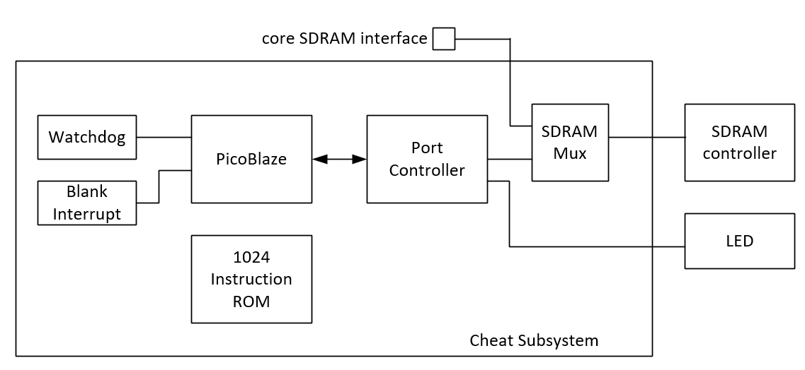

# Cheat Engine

The cheat engine consists of a Picoblaze compatible CPU that has full access
to SDRAM bank zero. This tiny CPU can be used to implement the MAME cheats,
as well as it can be used to perform other functions, like high-score
extraction and help in debugging the system during development.



The cheat engine comes with a cost in FPGA space usage and synthesis time, so
it is disabled by default. It is enabled by defining the macro **JTFRAME_CHEAT**.

See the [cheat tutorial](cheat-tutorial.md) for learning how to add new cheats.

## MRA File

Cheats are added to the MRA file like this:

```
    <cheats>
        <dip name="Infinite Credits" bits="0" ids="No,Yes"/>
        <dip name="P1 Infinite Lives" bits="1" ids="No,Yes"/>
        <dip name="P1 Invincibility" bits="2" ids="No,Yes"/>
    </cheats>
```

It basically follows the same syntax as the DIP switches, but the top element
is called `<cheats>`. There are a maximum of 32 bits available. The MiSTer
firmware must be older than 4th June 2021 to support it.

The MRA also needs to load the PizoBlaze firmware in ROM position 16:

```
    <rom index="16" zip="cheat.zip" md5="None">
        <part name="mycheat.bin"/>
    </rom>
```

## Port Map

Port (hex) | I/O    |  Usage
-----------|--------|-------------------------
2,1,0      | I/O    | SDRAM address (24 bits)
4,3        | O      | data to SDRAM
5          | O      | SDRAM write data mask, only bits 1,0. Active low
7,6        | I      | data read from SDRAM
6          | O      | bit 0 = board LED
40         | O      | Resets the watchdog
80         | O      | Starts SDRAM read
80         | I      | Reads peripheral status (bits 7:6)
C0         | O      | Starts SDRAM write

Uses the credits VRAM to display information:

Port (hex) | I/O    |  Usage
-----------|--------|-------------------------
8          | O      | VRAM address (JTFRAME_CREDITS required)
9          | I/O    | VRAM reads or writes
A          | O      | bit 0 enables the display

Communication with game module

Port (hex) | I/O    |  Usage
-----------|--------|-------------------------
C          | O      | Status address (JTFRAME_STATUS required)
D          | I      | Status data from game


The peripheral status bits are read from port 0x80:

Bit   |  Meaning
------|--------------
7     | Bus ownership, when high the Picoblaze is controlling the SDRAM
6     | high if a PicoBlaze started SDRAM transaction has not finished
5     | Low during vertical blanking
4:0   | Reserved

## Future Features

The following features will be added to the cheat subsystem

* Keyboard and joystick manipulation, both input and output
* Interrupt at vertical blank -currently a bug in the softcore prevents it
* Data dump via high-score/NVRAM interfaces
* Access to core state bus (memory mapped registers, etc.)

## Resources

* [PicoBlaze User Guide](https://www.xilinx.com/support/documentation/ip_documentation/ug129.pdf)
* [Open PicoBlaze Assembler](https://github.com/kevinpt/opbasm)
* [Macro support for opbasm](http://kevinpt.github.io/opbasm/rst/m4.html)
* [PicoBlaze VHDL generic version](https://github.com/krabo0om/pauloBlaze)
* [Holy Cheat! Guide](http://cheat.retrogames.com/download/holycheat!.zip)